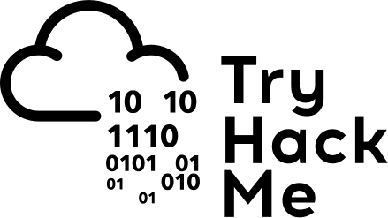
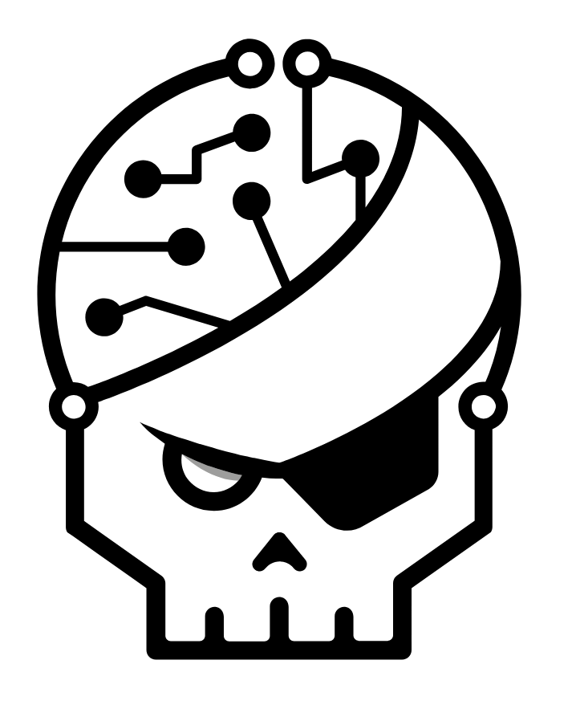
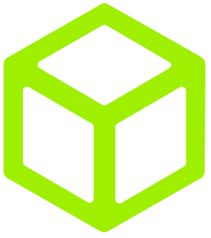
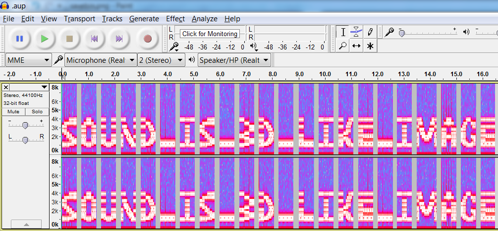
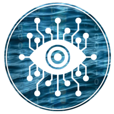

<link href="css/style.css" rel="stylesheet">

# CTF et challenges d'infosec

---

## Sommaire

<!-- .slide: class="align-left big-slide" -->

### 1. Les sites

### 2. Les catégories de challenges

---

# 1. Les sites

---

## OverTheWire

- https://overthewire.org
- Accompagnement : ⭐⭐⭐⭐
- Difficuté progressive : ⭐⭐⭐⭐⭐
- Nombre de catégories : ⭐⭐
- Prix : gratuit
- Langue : 🇬🇧

**Mon avis :** orienté Linux, utilisation basique puis de plus en plus avancée, très bien pour débuter


---

## TryHackMe

- https://tryhackme.com
- Accompagnement : ⭐⭐⭐⭐⭐
- Difficulté progressive : ⭐⭐⭐⭐⭐
- Nombre de catégories : ⭐⭐⭐
- Prix : offre gratuite et offre payante (8€/mois) pour avoir accès à toutes les ressources
- Langue : 🇬🇧
- Discord : https://discord.gg/tryhackme

**Mon avis :** orienté Pentesting, contient beaucoup de leçons sur les bases à connaître pour toute persone faisant de l'IT, très bien pour débuter



---

## RootMe

- https://root-me.org
- Accompagnement : ⭐⭐⭐
- Difficulté progressive : ⭐⭐⭐
- Nombre de catégories : ⭐⭐⭐⭐⭐
- Prix : offre gratuite très satisfaisante et offre payante (5€/mois) pour avoir accès aux nouveaux challenges en avant-première
- Langue : 🇫🇷
- Discord : https://discord.gg/wpk8xHr

**Mon avis :** ma plateforme de prédilection ! Très large choix tant sur les catégories que sur le nombre de challenges; des ressources disponibles mais parfois pas très guidé pour les débutants.



---

## HackTheBox

- https://www.hackthebox.com/
- Accompagnement : ⭐⭐⭐
- Difficulté progressive : ⭐⭐⭐
- Nombre de catégories : ⭐⭐⭐⭐⭐
- Prix : offre gratuite très satisfaisante et offre payante (12€/mois) pour avoir accès à des write-ups, les anciens challenges, ...
- Langue : 🇬🇧
- Discord : https://discord.com/invite/hackthebox

**Mon avis :** le pendant de rootme en anglais



---

## Cryptohack

- https://cryptohack.org
- Accompagnement : ⭐⭐⭐⭐⭐
- Difficulté progressive : ⭐⭐⭐⭐⭐
- Nombre de catégories : ⭐
- Prix : gratuit
- Langue : 🇬🇧
- Discord : https://discord.com/invite/h9E7cna5pV

**Mon avis :** uniquement de la cryptographie, mais extrêmement bien guidé, très bien pour débuter


---

## Newbiecontest

- https://newbiecontest.org
- Accompagnement : ⭐⭐
- Difficulté progressive : ⭐⭐⭐
- Nombre de catégories : ⭐⭐⭐⭐
- Prix : gratuit
- Langue : 🇫🇷
- Discord : https://discord.com/invite/h9E7cna5pV

**Mon avis :** rootme en moins bien


---

## ProjectEuler

- https://projecteuler.net
- Accompagnement : ⭐⭐⭐
- Difficulté progressive : ⭐⭐⭐⭐
- Nombre de catégories : ⭐
- Prix : gratuit
- Langue : 🇬🇧

**Mon avis :** orienté programmation et algorithmique, très bien pour par exemple apprendre un nouveau langage


---

# 2. Les catégories de challenges

---

## Web client

- Exploitation de vulnérabilités Web côté client (i.e navigateur), très souvent comprendre et exploiter des failles Javascript (XSS, CSRF, ...)

```js
function Login() {
  var pseudo = document.login.pseudo.value;
  var username = pseudo.toLowerCase();
  var password = document.login.password.value;
  password = password.toLowerCase();
  if (pseudo == "Admin" && password == "monsuperpass") {
    alert(
      "Password accepté, vous pouvez valider le challenge avec ce mot de passe."
    );
  } else {
    alert("Mauvais mot de passe");
  }
}
```

- **Technologies utilisées :** Navigateur, HTML, Javascript


---

## Web serveur

- Exploitation de vulnérabilités Web côté serveur, très souvent des failles PHP (LFI, SQLi, ...). Bien comprendre le protcole HTTP est un gros plus.

```php
<?php
    $query = "SELECT * FROM utilisateur WHERE login=".$_POST['login']." AND password=".$_POST[‘password’] ;
    $result = mysql_query($query) ;
    if (count(mysql_fetch_assoc($result)) > 0){
        echo "Vous êtes connecté !" ;
    }
?>
```

- **Technologies utilisées :** Navigateur, HTML, HTTP, PHP, SQL


---

## Cryptographie

- Exploitation de vulnérabilités cryptographique, déchiffrement de message.

```console
Q291Y291IGxlIFLDqXpvbMOpbwo=
```

- **Technologies utilisées :** Python (ou autre langage de scripting), hashage, encodage, chiffrement symétrique, chiffrement asymétrique


---

## Réseau

- Retrouver des données sensibles dans des communications réseaux, exploiter des vulnérabilités de certains protocoles.

Retrouvez les données confidentielles transmises dans cette trame Ethernet

```console
00 05 73 a0 00 00 e0 69 95 d8 5a 13 86 dd 60 00
00 00 00 9b 06 40 26 07 53 00 00 60 2a bc 00 00
00 00 ba de c0 de 20 01 41 d0 00 02 42 33 00 00
00 00 00 00 00 04 96 74 00 50 bc ea 7d b8 00 c1
d7 03 80 18 00 e1 cf a0 00 00 01 01 08 0a 09 3e
69 b9 17 a1 7e d3 47 45 54 20 2f 20 48 54 54 50
2f 31 2e 31 0d 0a 41 75 74 68 6f 72 69 7a 61 74
69 6f 6e 3a 20 42 61 73 69 63 20 59 32 39 75 5a
6d 6b 36 5a 47 56 75 64 47 6c 68 62 41 3d 3d 0d
0a 55 73 65 72 2d 41 67 65 6e 74 3a 20 49 6e 73
61 6e 65 42 72 6f 77 73 65 72 0d 0a 48 6f 73 74
3a 20 77 77 77 2e 6d 79 69 70 76 36 2e 6f 72 67
0d 0a 41 63 63 65 70 74 3a 20 2a 2f 2a 0d 0a 0d
0a
```

- **Technologies utilisées :** Wireshark, TCP/UDP, Ethernet, LDAP, DNS, SNMP, ...


---

## Programmation

- Automatiser des tâches pour répondre de manière rapide à des problèmes

Renvoyez le résultat d'une addition via une connexion TCP

```python
from pwnlib.tubes.remote import remote

conn = remote("chall1.mes-challenges.org", 52019)
data = conn.recv().decode("utf-8")

members = [e for e in data.split("+") if e != "+"]
tot = 0
for nb in members:
  tot += int(nb)

conn.send(bytes(str(tot) + "\n", "utf-8"))
print(conn.recv().decode("utf-8"))
```

- **Technologies utilisées :** Python (ou autre langage de programmation)


---

## Reverse / Cracking

- Désassembler des binaires, trouver des failles applicatives dans des exécutables

```console
(gdb) disas main
Dump of assembler code for function main:
...
   0x080486aa <+13>:  push   %ecx
   0x080486ab <+14>:  sub    $0x24,%esp
   0x080486ae <+17>:  movl   $0x8048841,-0x8(%ebp)
...
   0x080486fa <+93>:  mov    -0xc(%ebp),%eax
   0x080486fd <+96>:  mov    %eax,(%esp)
   0x08048700 <+99>:  call   0x80484d8 <strcmp@plt>
   0x08048705 <+104>: test   %eax,%eax
   0x08048707 <+106>: jne    0x804871e <main+129>
   0x08048709 <+108>: mov    -0x8(%ebp),%eax
   0x0804870c <+111>: mov    %eax,0x4(%esp)
```

- **Technologies utilisées :** Ghidra, Gdb, C, Assembleur


---

## Stéganographie

- Trouver de l'information cachée dans du texte, une image, du son, une vidéo



- **Technologies utilisées :** Python (ou autre langage de scripting), formats de fichier



---

## OSINT

- **Technologies utilisées :** Google, toutes sortes de script sur Github

```console
$ ./docker_hunt.sh email thibault.serti@gmail.com

[+] 1 account found !
Name : Thibault Serti
[-] Default profile picture
Last profile edit : 2021/10/24 15:25:52 (UTC)
Email : thibault.serti@gmail.com
Google ID : 115045422249008610174
Hangouts Bot : No

...

Google Calendar : https://calendar.google.com/calendar/u/0/embed?src=thibault.serti@gmail.com
[-] No public Google Calendar.
```


---

## Forensics

- Analyse de logs, investigations post-attaque permettant de reconstituer l'exploitation d'une vulnérabilité

```console
192.168.1.23 - - [18/Jun/2015:12:12:54 +0200] "GET /admin/?action=membres&order=QVNDLChzZWxlY3%3D HTTP/1.1" 200 1005 "-" "-"
192.168.1.23 - - [18/Jun/2015:12:13:00 +0200] "GET /admin/?action=membres&order=AryTUO6784FLFc%3D HTTP/1.1" 200 1005 "-" "-"
192.168.1.23 - - [18/Jun/2015:12:13:00 +0200] "GET /admin/?action=membres&order=PFOfek8FEN86cp%3D HTTP/1.1" 200 1005 "-" "-"
...
```

- **Technologies utilisées :** Volatility, système de fichier, Python (ou autre langage de scripting)


---

## Pwn

- Exploiter des vulnérabilités du système d'exploitation, de scripts ou de permissions souvent dans le but d'obtenir une élévation de privilèges

```console
$ cat .bash_history
vim myscript.sh
vi myscript.sh
sudo apt install vim-tiny
sudo apt install update
sudo apt update
sudo apt install vim-tiny
ls
...
sufo ./myscript.sh
tomatosoup
```

- **Technologies utilisées :** Bash, Linux, Windows


---

## Réaliste / Box / Wargames

- **Réaliste :** combine plusieurs catégories dans un même challenge.
- **Box** : machine à rooter entièrement, très peu d'indication fourni. Se veut être le plus proche possible de pentest réel
- **Wargames** : même chose que les box mais avec un équipe d'attaquant (dont le but et de rooter la machine) et une équipe de défenseur (dont le but est de la sécuriser).


---

## Comment devenir meilleur ?

- S'entraîner (beaucoup), faire le plus de challenges possibles
- Participer à des CTF (CTFtime)
- Participer aux CTF pour les étudiants (TRACS, Wavegame, European CyberSecurity Challenge, ...)
- Lire des write-ups

- Même quand on ne réussit pas, on apprend des choses en cherchant.
- N'aller pas voir la solution (préférez qqn qui vous donne des indices)
- Si vous lisez la solution, **reproduisez la !**

---

## Ressources

- 📹 https://www.youtube.com/c/LiveOverflow
- 📹 https://www.youtube.com/c/JohnHammond010